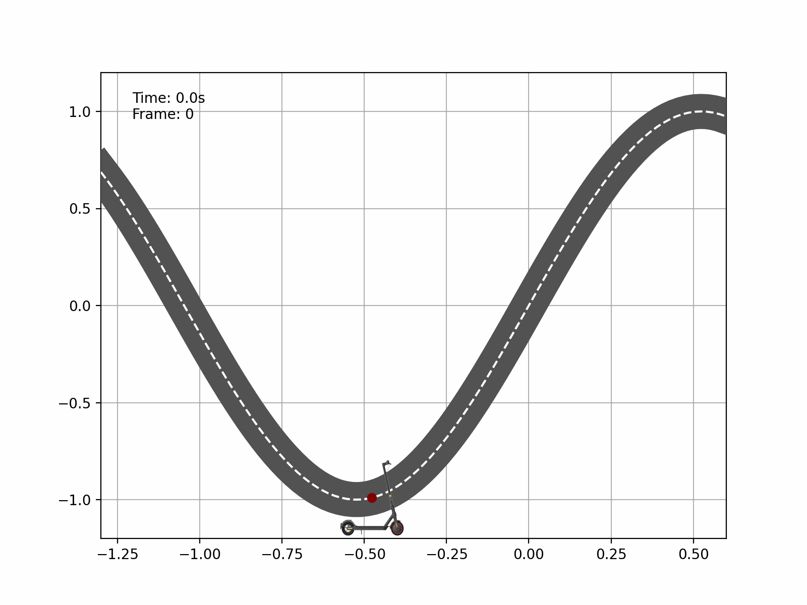
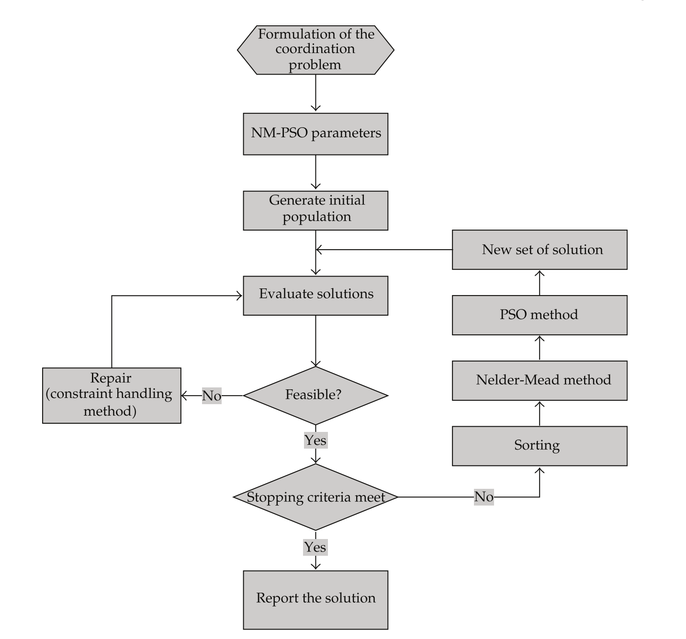
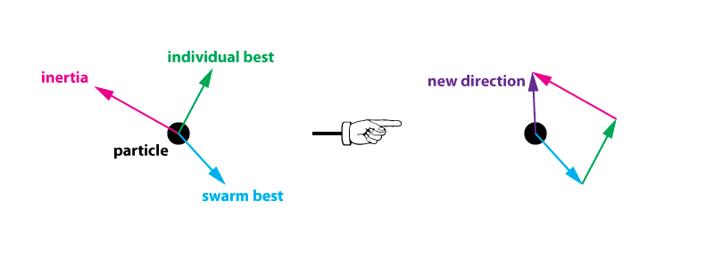
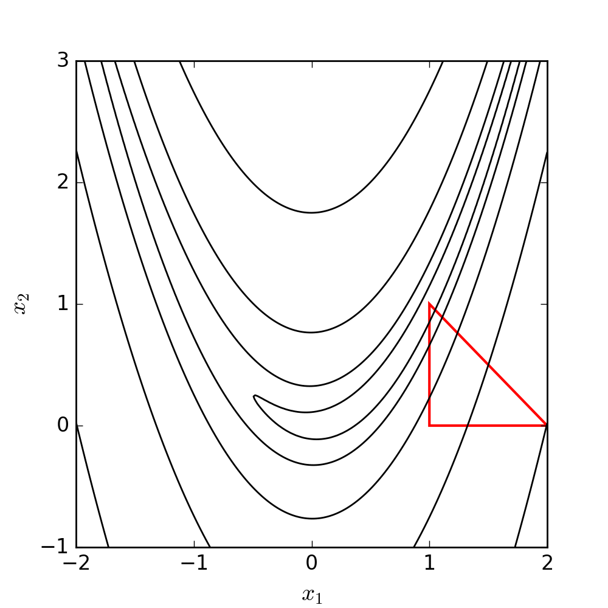
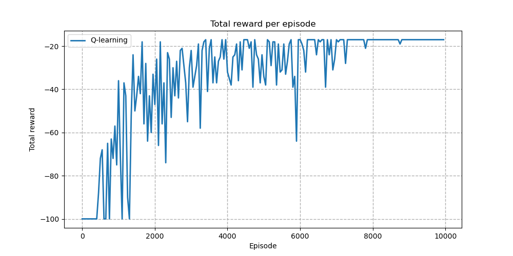
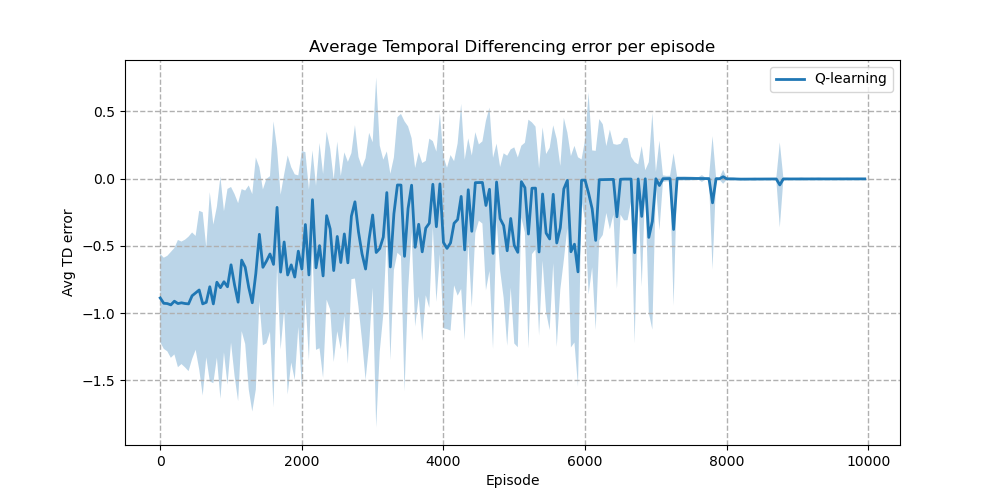

# Mountain Scooter Problem

This repository contains a project realized as part of the *Combinatorial Decision Making and Optimization course* exam of the [Master's degree in Artificial Intelligence, University of Bologna](https://corsi.unibo.it/2cycle/artificial-intelligence).

### Description

The well known *Mountain Car problem* is a classic reinforcement learning problem, but in this project I used the analogy of **Mountain Scooter** since it's better to use an electric scooter cause of the soar in fuel prices during those days 🛵.

The original problem was first described by Andrew Moore in his PhD thesis [[1]](http://citeseerx.ist.psu.edu/viewdoc/summary?doi=10.1.1.17.2654) and it is defined as follows: a mountain car is moving on a two-hills landscape. The engine of the car isn't stronger enough and even at full throttle the car cannot accelerate up the steep climb, as you can see from the following animation:

The driver has to find a way to reach the top of the hill. The only solution is to first move away from the goal and up the opposite slope on the left.
The reward in this problem is -1 on all time steps until the car moves past its goal position at the top of the mountain, which ends the episode. The reward obtained when the car reaches the goal is 0. 

There are three possible **actions**: full *throttle forward* (+1), full *throttle reverse* (-1), and *zero throttle* (0). The car moves according to a simplified physics:

- the state space is defined by the position $x$ obtained through the function $sin(3x)$ in the domain $[-1.2, +0.5]$ (m) and the velocity $\hat{x}$ defined in the interval $[-1.8, +1.8]$ (m/s).

- for each action (left, no-op, right) there is a correspondent force applied to the car: $a= [-1.0, 0.0, +1.0]$

- the mass of the car is $m=0.4 kg$, the gravity is $g=9.8 m/s^2$, the friction is defined by $k=0.3 N$, and the time step is $\Delta t=0.1s$ .

- the position $p$ and velocity $v$ of the car at $t+1$ are updated using the following equations
  $$
  p_{t+1} = bound \left[p_{t}+v_{t+1} \Delta t\right] 
  \\\ v_{t+1} = bound \left[v_{t}+ \left( g \; m \cos \left(3 p_{t}\right) + \frac{a_t}{m} - k \; v_t\right) \Delta t\right]
  $$
  where the $bound$ operation enforces $-1.2 \leq p_{t+1} \leq 0.5$ and $-1.5 \leq v_{t+1} \leq 1.5$. 
  
  In addition, when $p_{t+1}$ reached the left bound, $p_{t+1}$ was reset to zero. When it reached the right bound, the goal was reached and the episode was terminated.

Each episode started from a position $p_t=-0.5$ and zero velocity.

To convert the two continuous state variables to binary features, we used grid space discretizing each dimension in 20 bins.

### Solution proposed

To solve this problem, 2 different solution are been implemented: Hybrid Nelder-Mead Particle Swarm Optimization and Q-Learning algorithm.

#### Hybrid Nelder-Mead Particle Swarm Optimization

Th hybrid *Nelder-Mead Particle Swarm Optimization* algorithm [[2]](https://www.hindawi.com/journals/mpe/2012/456047/) is an attempt to combine two different optimization methods where PSO is the main optimizer, and the Nelder-Mead simplex search method is used to improve the efficiency of PSO due to its potential for rapid convergence. 

The following flow chart explain how this algorithm works.

Choosing the correct representation for a problem is the most important task in the design for this kind algorithm. For this solution, the **Neuroevoultion** studies are been taken as reference. Indeed it is possible to represent a particle as a *neural network* that is able to map the position and the velocity in input to an action. The most straightforward approach to represent a neural network would be using a real-valued array containing the weights and biases, and instead of adjusting weights of one network through supervision of examples, we evolves populations of networks.

So the evaluation of a particle would be just the execution of the neural network many times to get an action until the termination condition (100 steps) is reached.

In order to have a better understanding of PSO and Nelder-Mead methods, a detailed explanation  is provided.

##### Particle Swarm Optimization

Developed in 1995 by Eberhart and Kennedy, PSO is a biologically inspired optimization routine designed to mimic birds flocking or fish schooling. PSO is not guaranteed to find the global minimum, but it does a solid job in challenging, high dimensional, non-convex, non-continuous environments.

A *particle* is a individual, or in other words a population member *i*, and it is a 3-tuple $\langle \bar{x}_i, \bar{v}_i, \bar{b}_i \rangle$ of:

- a position vector (location) $\bar{x}_i$

- a velocity vector $\bar{v}_i$

- a best position vector of this particle in the past $\bar{b}_i$

Each triple is replaced by the mutant triple $\langle \bar{x}_i, \bar{v}_i, \bar{b}_i \rangle \rightarrow \langle \bar{x}_i', \bar{v}_i', \bar{b}_i' \rangle$ s.t.

- $\bar{x}_{i}^{\prime}=\bar{x}_i+\bar{v}_{i}^{\prime}$
- $\bar{v}_{i}^{\prime}=w \cdot \bar{v}_{i}+c_{1} R_{1} \cdot\left(\bar{b}_{i}-\bar{x}_{i}\right)+c_{2} R_{2} \cdot\left(\bar{p}-\bar{x}_{i}\right)$
- $\bar{b}_{i}^{\prime}=\left\{\begin{array}{cc}\bar{x}_{i}^{\prime} & \text { if } f\left(\bar{x}_{i}^{\prime}\right)<f\left(\bar{b}_{i}\right) \\ \bar{b}_{i} & \text { otherwise }\end{array}\right.$

where $w$ and $c_{i}$ are the weights and $R_{1}$ and *$R_2$* randomizer matrices and  $\bar{p}$  denotes the populations global best.

From the particle velocity equation, two important groups emerge:

1. social term: $c_{2} R_{2} \cdot\left(\bar{p}-\bar{x}_{i}\right)$
2. cognitive term: $c_{1} R_{1} \cdot\left(\bar{b}_{i}-\bar{x}_{i}\right)$

Instead the value of $w$ can control exploration and exploitation.

The main concept behind PSO, which is evident from the particle velocity equation above, is that there is a constant balance between three distinct forces pulling on each particle:

1. The particles previous velocity (inertia)
2. Distance from the individual particles’ best known position (cognitive force) 
3. Distance from the swarms best known position (social force)

These three forces are then weighted by $w$, $c_1$, $c_2$ and randomly perturbed by $R_1$ and $R_2$.

In vector form, these three forces can be seen below (vector magnitude represents the weight value of that specific force):

This method is also suitable to solve RL problems, indeed Particle Swarm Optimization Policy (PSO-P) variant [[3]](https://ideas.repec.org/a/igg/jsir00/v7y2016i3p23-42.html) is effective for high dimensional state spaces and does not require a priori assumptions about adequate policy representations.

##### Nelder Mead method

The Nelder–Mead method is *direct search* method (does not require any information about the gradient of the objective function) and is often applied to nonlinear optimization problems for which derivatives may not be known. 

The method in *n* dimensions maintains a set of *n* + 1 test points arranged as a simplex.  It then extrapolates the behavior of the objective function measured at each test point in order to find a new test point and to replace one of the old test points with the new one, and so the technique progresses. 

The behavior of this method is based on four operations: **reflection**, **expansion**, **contraction**, **shrinkage**. These are usually tried in this order. Basically, what they do is the following:

- **Reflection**: tries moving the simplex away from the sub-optimal area, by computing the reflected point through the centroid of the other points, excluding the worst one;
- **Expansion**: if reflection generated a point which is better than the current best, the point is moved along the same direction for a bit further;
- **Contraction**: if, on the contrary, the reflected point did not improve the result, we'll want to *contract* the simplex towards the best point;
- **Shrinkage**: if none of the previous did work, we'll want to re-calculate all the points except for the best one, computing them through the best one's coordinates.

#### Q-Learning algorithm

The implementation of *Q-Learning off-policy TD control algorithm* used to search the optimal policy is the standard one defined by by Sutton and Barto [[4]](http://incompleteideas.net/book/ebook/node65.html) and it follow the pseudocode written in figure below.

The hyperparameters used are the following:

  - *discount\_factor*=1.0 

  - *num\_episodes*=10000 (number of episodes to use for the training)

  - *epsilon*=0.4 (starting value for the $\epsilon$-greedy policy, that will be decayed over time)

  - *alpha*=0.1 (starting value used for the learning rate, that will be decayed over time)

The Q-learning algorithm estimate directly the optimal value function $q^*$ without a given policy $\pi$ to improve. The update rule for Q-learning is: 
$$
q\left(s, a\right) \leftarrow q\left(s, a\right)+\alpha\left[r+\gamma \max _{a'} q\left(s', a'\right)-q\left(s, a\right)\right]
$$

### Results

Both algorithms allow to obtain the optimal solution, in which the scooter is able to reach the top of the hill going back first and then forward in just 17 steps. The Nelder-Mead Particle Swarm Optimization is a clear strength demonstration of this alternative technique, able to give the optimal solution in less than 20 iterations!

Rendering the evolution of the V-value function during each episode of the Q-learning algorithm we can observe how the algorithm understood that the maximal reward is given not always when the scooter is near the goal, but always when it is close to the position -1.25 because from that point it have the necessary boost to climb the hill.

The Q-learning algorithm after 10000 episodes has reached the optimal policy, as we can observe from the following plot :

For each episode, the Temporal Differencing error (TD) in each step was computed and the figure below shows the average and the standard deviation along the training. This give an insight about the speed of convergence.

### References

[1] Andrew William Moore. Efficient Memory-based Learning for Robot Control. 1990. URL: [http://citeseerx.ist.psu.edu/viewdoc/summary?doi=10.1.1.17.2654]

[2] An Liu et al. A New Hybrid Nelder-Mead Particle Swarm Optimization for Coordination Optimization of Directional Overcurrent Relays. 2012. URL: [https://www.hindawi.com/journals/mpe/2012/456047/]

[3] Daniel Hein et al. Reinforcement Learning with Particle Swarm Optimization Policy (PSO-P) in Continuous State and Action Spaces. 2016. URL: [https://ideas.repec.org/a/igg/jsir00/v7y2016i3p23-42.html]

[4] Richard  S.  Sutton  and  Andrew  G.  Barto. ReinforcementLearning: An Introduction. Second. The MIT Press, 2018. URL: [http://incompleteideas.net/book/the-book-2nd.html]

## Author

| Reg No. |   Name   | Surname |              Email               |               Username                |
| :-----: | :------: | :-----: | :------------------------------: | :-----------------------------------: |
| 997317  | Giuseppe |  Murro  | `giuseppe.murro@studio.unibo.it` | [_gmurro_](https://github.com/gmurro) |

## License

This project is licensed under the MIT License - see the [LICENSE](LICENSE) file for details
